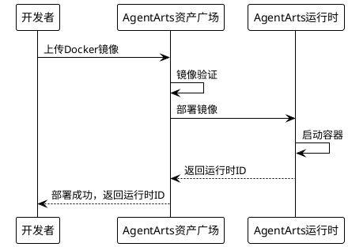
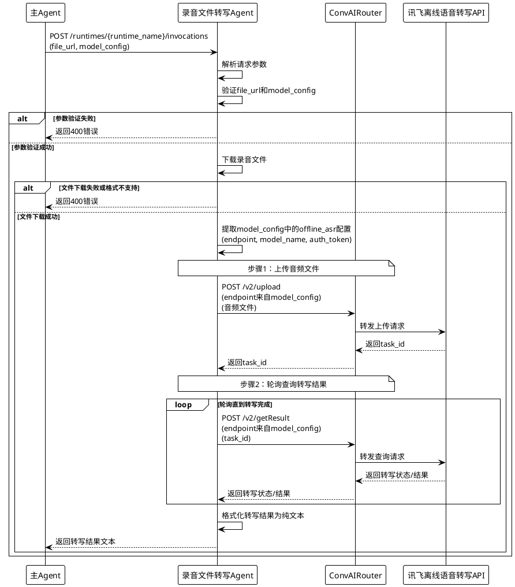

# FE2026080500089 Design 增量设计

> 本文档描述对 DESIGN.md 的增量变更。
> 完成后需合并到全量 DESIGN.md 中。

> **注意**：本FE仅聚焦于 录音文件转写Agent 开发，模型注入机制由FE2026080500414-subagent-metadata-management提供。

---

## 1. 设计背景

### 1.1 设计目标

- 实现录音文件转写Agent的独立开发，交付Docker镜像，发布到AgentArts资产广场
- 支持通过模型注入机制动态配置讯飞离线语音转写API参数
- 实现录音文件URL输入，返回纯文本转写结果

### 1.2 设计约束

1. 录音文件转写Agent基于讯飞离线语音转写API开发，交付形式为Docker镜像
2. 一个录音文件转写Agent可部署为多个运行时ID
3. Agent包可独立运行，无外部依赖错误
4. 遵循AgentArts标准接口规范
5. 模型注入参数遵循FE2026080500414定义的offline_asr类型标准结构

### 1.3 非目标

- 讯飞离线语音转写API的具体实现
- AgentArts资产广场平台改造
- 模型注入白名单管理（FE2026080500414负责）
- 模型注入配置的存储和管理（FE2026080500414负责）
- 调用子Agent时的模型注入流程（FE2026080500414负责）

---

## 2. 设计决策

### 2.1 录音文件转写Agent交付形式

**决策**：录音文件转写Agent以Docker镜像形式交付

**背景**：录音文件转写Agent需要独立部署到AgentArts运行时，必须打包为容器镜像

**方案对比**：

| 方案 | 优点 | 缺点 |
|------|------|------|
| Docker镜像（采纳） | 环境隔离、可移植性强、易于部署 | 镜像体积可能较大 |
| JAR包 | 启动快、体积小 | 需要目标环境有JRE、依赖复杂 |

**理由**：AgentArts运行时要求以Docker镜像形式部署，且录音文件转写Agent依赖Python环境和讯飞SDK，Docker是最合适的交付形式。

### 2.2 部署灵活性

**决策**：一个录音文件转写Agent可以部署为多个运行时ID

**背景**：多个智能体可以共用同一个录音文件转写Agent实例，也可以根据配置选择独立部署的录音文件转写Agent实例

**理由**：提高资源利用效率，支持灵活部署策略

### 2.3 讯飞API调用方式

**决策**：Agent通过ConvAIRouter调用讯飞离线语音转写服务，使用两个API接口

**背景**：
- 讯飞离线语音转写API提供两个接口：音频上传接口（/v2/upload）和结果查询接口（/v2/getResult）
- 录音文件转写Agent使用model_config中注入的endpoint地址，该地址指向ConvAIRouter
- ConvAIRouter作为模型网关，负责将请求转发给实际的讯飞API

**调用流程**：
1. 调用ConvAIRouter的/v2/upload接口上传音频文件，获取task_id
2. 轮询调用ConvAIRouter的/v2/getResult接口查询转写结果

**理由**：
- 通过ConvAIRouter统一路由，便于鉴权、统计和监控
- 异步转写模式适合大文件处理，避免长时间等待

### 2.4 模型注入参数解析

**决策**：Agent从请求Body的model_config参数中解析offline_asr类型的配置

**背景**：主Agent调用时通过model_config注入模型配置，录音文件转写Agent需要解析并使用

**参数结构**：

```json
{
  "type": "offline_asr",
  "provider": "openai-compatible",
  "endpoint": "讯飞API endpoint",
  "model_name": "讯飞模型名称",
  "auth_token": "Bearer 认证token"
}
```

**理由**：遵循FE2026080500414定义的统一模型注入规范，保持系统一致性

---

## 3. 数据模型变更

### 3.1 无数据模型变更

本FE仅涉及录音文件转写Agent开发，不涉及数据模型变更。

---

## 4. 接口设计变更

### 4.1 无接口变更

本FE仅涉及录音文件转写Agent开发，不涉及接口变更。录音文件转写Agent遵循AgentArts标准接口规范。

**标准接口**：POST /runtimes/{runtime_name}/invocations

**请求Body结构**：

```json
{
  "input": {
    "file_url": "录音文件URL"
  },
  "model_config": [
    {
      "type": "offline_asr",
      "provider": "openai-compatible",
      "endpoint": "讯飞API endpoint",
      "model_name": "讯飞模型名称",
      "auth_token": "Bearer 认证token"
    }
  ]
}
```

**响应结构**：

```json
{
  "output": {
    "text": "转写结果文本"
  }
}
```

---

## 5. 流程设计

### 5.1 录音文件转写Agent部署流程



**流程说明**：
1. 开发者将录音文件转写Agent Docker镜像上传到AgentArts资产广场
2. AgentArts资产广场验证镜像格式和依赖
3. 验证通过后，将镜像部署到AgentArts运行时
4. 运行时启动容器，生成唯一的运行时ID
5. 部署成功后，返回运行时ID给开发者

### 5.2 录音文件转写流程



**流程说明**：
1. 主Agent通过AgentArts标准接口调用录音文件转写Agent
2. 录音文件转写Agent解析请求参数，验证file_url和model_config
3. 参数验证失败则返回400错误
4. 参数验证成功后，下载录音文件
5. 文件下载失败或格式不支持则返回400错误
6. 文件下载成功后，提取model_config中的offline_asr配置（endpoint、model_name、auth_token）
7. **步骤1：上传音频文件**
   - 录音文件转写Agent使用model_config中的endpoint地址调用ConvAIRouter的/v2/upload接口
   - ConvAIRouter将请求转发给讯飞离线语音转写API
   - 讯飞API返回task_id，通过ConvAIRouter返回给录音文件转写Agent
8. **步骤2：轮询查询转写结果**
   - 录音文件转写Agent使用相同的endpoint地址调用ConvAIRouter的/v2/getResult接口
   - ConvAIRouter将请求转发给讯飞离线语音转写API
   - 讯飞API返回转写状态或结果，通过ConvAIRouter返回
   - 轮询直到转写完成
9. 转写完成后，格式化为纯文本
10. 返回转写结果给主Agent

**关键说明**：
- 录音文件转写Agent使用model_config中注入的endpoint地址，该地址指向ConvAIRouter
- ConvAIRouter作为模型网关，负责将请求转发给实际的讯飞离线语音转写API
- 这种架构使得模型调用可以统一通过ConvAIRouter进行路由、鉴权和统计

---

## 6. 风险与缓解

| 风险 | 可能性 | 影响 | 缓解措施 |
|------|--------|------|----------|
| Docker镜像体积过大 | 中 | 中 | 优化镜像层，使用多阶段构建 |
| AgentArts运行时部署失败 | 低 | 高 | 提供详细的部署日志和错误提示 |
| 录音文件转写Agent运行异常 | 中 | 中 | 提供健康检查接口，支持自动重启 |
| ConvAIRouter不可用 | 中 | 高 | 返回明确错误信息，支持重试机制 |
| 讯飞API调用失败 | 中 | 高 | 返回明确错误信息，支持重试机制 |
| 大文件下载超时 | 中 | 中 | 设置合理的超时时间，支持断点续传 |
| 转写结果轮询超时 | 中 | 中 | 设置最大轮询次数和超时时间 |
| 模型配置缺失 | 低 | 高 | 参数验证时检查model_config，返回明确错误 |

---

## 7. 待解决问题

- [ ] 录音文件转写Agent Docker镜像基础镜像选择
- [ ] 镜像大小优化方案
- [ ] 讯飞API的具体调用参数和认证方式
- [ ] 大文件下载的超时时间和重试策略

---

## 合并检查清单

- [ ] 设计决策已添加到 DESIGN.md 对应章节
- [ ] 流程设计已添加到 DESIGN.md 第5节
- [ ] PlantUML 图表可正常渲染

## 约束

- 设计要与 DESIGN.md 的架构风格保持一致
- 每个设计决策要说明理由
- 考虑与现有系统的兼容性
- 本FE仅聚焦于 录音文件转写Agent 开发，模型注入机制由FE2026080500414提供