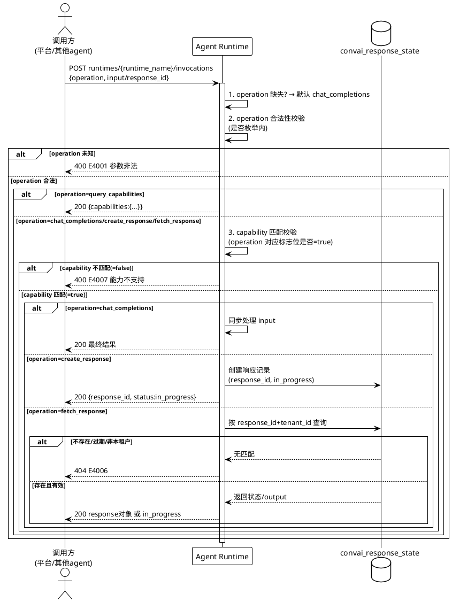
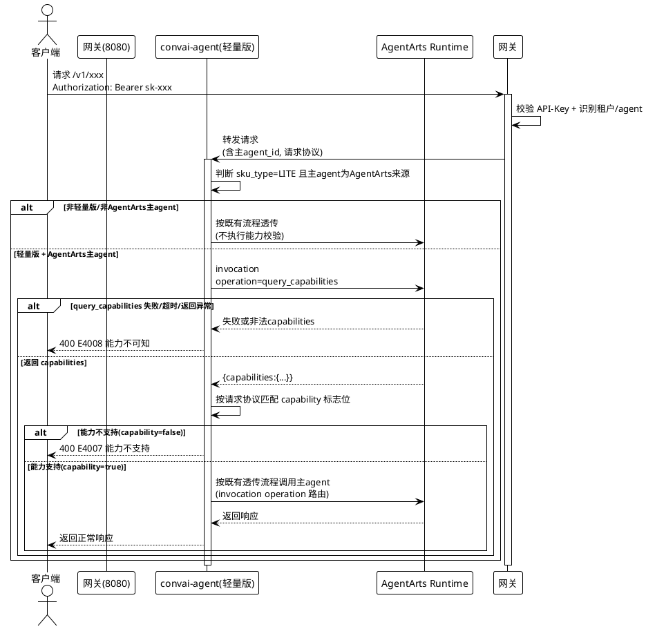

# FE2026081400138 独立Agent运行时接口规则 Spec 增量设计

> 本文档描述对 SPEC.md 的增量变更，使用 ADDED/MODIFIED/REMOVED 标记。
> 本次变更基于 FE2026072300156-Responses-API（5.10-5.14、convai_response_state）、FE2026081400096-Responses-Query-Support（5.15-5.17、6.11、9.3.1）已定义的增量做进一步增量，并联动修订 0096 的元数据持久化机制。
> 完成后需合并到全量 SPEC.md 中。

---

## ADDED Requirements

> 新增的业务规则和能力

### 5.18 独立 Agent 运行时接口规则

> 本节定义所有经 AgentArts 部署的独立 agent（垂域 agent）在运行时执行接口 `runtimes/{runtime_name}/invocations` 上必须遵循的统一规则：能力查询、operation 路由、向后兼容默认行为。该规则为**通用强制规格**，当前首批 4 个 agent（拍照问答/文旅导览/录音转写/mobile use）落地，后续新增独立 agent 必须遵循。

#### 5.18.1 业务规则

1. **能力查询规则（query_capabilities）**：每个独立 agent 必须在 `runtimes/{runtime_name}/invocations` 接口上支持 `operation=query_capabilities`，返回且仅返回 `capabilities` 能力标志位对象，包含 `chat_completions` / `responses_api` / `responses_get_fetch` 三个布尔标志位。
   - **验收条件**：对任意独立 agent 发起 `operation=query_capabilities` → 返回 `{"capabilities": {"chat_completions": bool, "responses_api": bool, "responses_get_fetch": bool}}`
   - **验收条件**：响应体仅含 `capabilities` 对象，不含 agent_id / endpoint_base / supported_apis / stream_support / version_tag 等其他元数据字段
   - **验收条件**：query_capabilities 为元操作，不校验 capability、不产生业务副作用，任意 agent 均必须支持

2. **operation 路由规则**：`runtimes/{runtime_name}/invocations` 接口入参支持 `operation` 字段，按其取值路由到对应协议处理逻辑。operation 枚举值与对应 capability 映射如下：

   | operation 值 | 对应 capability | 行为 | 必填参数 |
   |--------------|-----------------|------|----------|
   | chat_completions | chat_completions | 同步对话，返回最终结果 | input |
   | create_response | responses_api | 异步创建响应，返回 response_id 与初始状态 | input |
   | fetch_response | responses_get_fetch | 按 response_id 查询异步响应结果 | response_id |
   | query_capabilities | （元操作） | 返回 capabilities 对象 | 无 |

   - **验收条件**：`operation=chat_completions` + input → 走同步对话，返回最终结果
   - **验收条件**：`operation=create_response` + input → 创建异步响应，返回 response_id 与初始状态（in_progress）
   - **验收条件**：`operation=fetch_response` + response_id → 查询响应结果，返回完整 OpenAI response 对象（已完成）或进行中状态
   - **验收条件**：`operation=query_capabilities` → 返回 capabilities 对象

3. **向后兼容默认规则**：当 invocation 请求**未携带 operation 字段**（或 operation 为空）且携带 `input` 时，默认按 `chat_completions` 路由处理，以兼容既有调用方（实时语音流、轻量版透传流）。
   - **验收条件**：无 operation 仅 input 的请求 → 等同于 `operation=chat_completions` 处理
   - **验收条件**：既有调用链路（design.md 实时语音流、轻量版透传流）行为不变
   - **验收条件**：默认路由后仍受 5.18.1 规则 5（runtime 能力校验）约束——若该 agent 声明 `chat_completions=false`，默认路由后返回 E4007 能力不支持

4. **响应契约规则**：create_response 与 fetch_response 的响应绑定 OpenAI response 对象，复用 FE2026072300156 / 0096 已定义的 convai_response_state 状态存储。
   - **验收条件**：`operation=create_response` → 返回 `response_id`（格式 `resp_{uuid}`，见 5.11.1）与初始状态 `in_progress`
   - **验收条件**：`operation=fetch_response` 且响应已完成 → 返回完整 OpenAI response 对象（与 5.10.4 / 5.15.5 响应格式一致），含完整 output
   - **验收条件**：`operation=fetch_response` 且响应进行中 → 返回 `in_progress` 状态
   - **验收条件**：create_response 产生的 response_id 可被平台 `GET /v1/responses/{response_id}`（5.15）查询，结果一致

5. **runtime 双层能力校验规则**：agent runtime 在执行 operation 路由前，必须校验 operation 的合法性与 capability 匹配性，与平台侧能力前置校验（5.17）形成双层防护。
   - **验收条件**：operation 为未知枚举值（不在 chat_completions / create_response / fetch_response / query_capabilities 之内）→ runtime 返回 400，错误码 E4001（参数非法），不执行业务
   - **验收条件**：operation 合法但超出 agent 声明 capability（如同步 agent 收到 `create_response` 且 `responses_api=false`）→ runtime 返回 400，错误码 E4007（能力不支持），不执行业务
   - **验收条件**：`fetch_response` 缺失 `response_id` 参数 → runtime 返回 400，错误码 E4001（参数非法）
   - **验收条件**：operation 合法且 capability 匹配 → 正常路由执行

6. **能力声明约束规则**：agent 声明的 capabilities 必须满足能力依赖关系——`responses_get_fetch=true` 时 `responses_api` 必须为 `true`（查询响应是创建响应的子能力，依赖创建能力）。
   - **验收条件**：capabilities 中 `responses_get_fetch=true` 但 `responses_api=false` → 声明非法，runtime 在 query_capabilities 返回前校正或部署时拒绝（具体校验时机见 Design）
   - **验收条件**：`chat_completions` 与 `responses_api` / `responses_get_fetch` 可独立组合，无强制互斥

7. **禁止项**：
   - 禁止 agent 不支持 query_capabilities operation（所有独立 agent 必须支持）
   - 禁止 runtime 在 operation 非法或 capability 不匹配时仍执行业务
   - 禁止 query_capabilities 返回 capabilities 对象以外的字段（能力声明仅此一种获取途径）
   - **验收条件**：任一独立 agent 不支持 query_capabilities → 视为违反规格，该 agent 不可上线
   - **验收条件**：operation 非法 / capability 不匹配时 runtime 必须返回错误，不执行业务

#### 5.18.2 能力声明矩阵（首批 4 个垂域 agent，声明性描述）

| Agent | 来源 FE | 响应模式 | chat_completions | responses_api | responses_get_fetch |
|-------|---------|----------|:---:|:---:|:---:|
| 拍照问答 agent | FE2026080700221 | 同步 | true | false | false |
| 文旅导览 agent | FE2026080400165 | 同步 | true | false | false |
| 录音转写 agent | FE2026080500089 | 异步 | false | true | true |
| mobile use agent | FE2026072400109 | 异步 | false | true | true |

> 上述为当前 4 个 agent 的声明值，属声明性描述，非强制约束矩阵。后续新增 agent 可按自身能力自由组合声明，但必须满足 5.18.1 规则 6 的能力依赖关系，且必须实现 query_capabilities 与 operation 路由。

#### 5.18.3 交互流程

#### 5.18.4 异常场景

1. **场景：operation 为未知枚举值**
   - **触发条件**：请求携带的 operation 不在 `chat_completions / create_response / fetch_response / query_capabilities` 之内
   - **系统行为**：runtime 拒绝执行，返回 400
   - **用户感知**：错误码 E4001，错误信息"参数非法"

2. **场景：operation 超出 agent 声明 capability**
   - **触发条件**：operation 合法但 agent 声明的对应 capability 为 false（如同步 agent 收到 create_response）
   - **系统行为**：runtime 拒绝执行，返回 400，不发起业务处理
   - **用户感知**：错误码 E4007，错误信息"能力不支持"

3. **场景：fetch_response 缺失 response_id**
   - **触发条件**：`operation=fetch_response` 但未携带 response_id
   - **系统行为**：runtime 拒绝执行，返回 400
   - **用户感知**：错误码 E4001，错误信息"参数非法"

4. **场景：fetch_response 查询的响应不存在 / 已过期 / 非本租户**
   - **触发条件**：response_id 在 convai_response_state 中无记录 / 已过期（>24h）/ tenant_id 不匹配
   - **系统行为**：返回 404，不泄露响应存在性（三种情况返回一致）
   - **用户感知**：错误码 E4006，错误信息"响应不存在或已过期"

5. **场景：默认 chat_completions 但 agent 不支持**
   - **触发条件**：请求无 operation 仅 input，但 agent 声明 `chat_completions=false`（如异步 agent）
   - **系统行为**：默认路由 chat_completions 后，capability 校验失败，返回 400
   - **用户感知**：错误码 E4007，错误信息"能力不支持"（调用方需显式指定正确 operation）

6. **场景：能力声明违反依赖关系**
   - **触发条件**：agent 声明 `responses_get_fetch=true` 但 `responses_api=false`
   - **系统行为**：声明非法，拒绝该 agent 上线 / 校正声明
   - **用户感知**：部署或启动阶段错误提示"能力声明违反依赖关系"

---

### 5.15/5.17/5.18 新增与修订错误码汇总

| 错误码 | HTTP 状态码 | 说明 | 触发场景 | 来源 |
|--------|-------------|------|----------|------|
| E4001 | 400 | 参数非法 | operation 未知枚举值；fetch_response 缺失 response_id | 复用 FE2026072300156 |
| E4006 | 404 | 响应不存在或已过期 | fetch_response 时 response_id 不存在/已过期(>24h)/非本租户 | 复用 0096 |
| E4007 | 400 | 能力不支持 | operation 超出 agent 声明 capability（runtime 双层校验 + 平台 pre-check） | 复用 0096 |
| E4008 | 400 | 能力不可知 | 平台 pre-check 调 query_capabilities 失败/超时/返回异常，无法确定能力 | 复用 0096（语义变更：元数据缺失→query_capabilities 失败） |

> 错误码编号衔接 FE2026072300156（E4001/E4004/E4005/E4010/E4290）与 0096（E4006/E4007/E4008），不与既有错误码冲突。E4008 语义随 5.17 修订由"元数据缺失"变更为"query_capabilities 失败"。

---

## MODIFIED Requirements

> 修改的现有业务规则（需写出完整修改后的内容）

### 5.17 主 Agent 能力前置校验（0096 新增，本次修订）

#### 5.17.1 业务规则

1. **校验触发规则**：在轻量版智能体（L5，sku_type=LITE）配置 AgentArts agent 为主 agent 的场景下，调用主 agent 的所有协议接口前，必须先执行能力前置校验。
   - **验收条件**：轻量版智能体调用主 agent 的 `POST /v1/chat/completions` 前执行能力校验
   - **验收条件**：轻量版智能体调用主 agent 的 `POST /v1/responses` 前执行能力校验
   - **验收条件**：轻量版智能体调用主 agent 的 `GET /v1/responses/{response_id}` 前执行能力校验
   - **验收条件**：全能版智能体（sku_type=STANDARD）不触发本能力校验规则

2. **校验内容规则（修订）**：能力校验时，平台（convai-agent）通过调用主 agent runtime 的 `runtimes/{runtime_name}/invocations`（`operation=query_capabilities`）获取主 agent 的 capabilities 能力标志位（见 5.18.1 规则 1），按客户端发起的请求协议匹配对应 capability 标志位，标志位为 true 则校验通过，为 false 则校验失败。
   - **验收条件**：pre-check 调用 `operation=query_capabilities` 获取主 agent capabilities ← (原为: 读取主 agent 持久化元数据 agent_metadata)
   - **验收条件**：请求 `POST /v1/responses`，主 agent capabilities.responses_api=true → 校验通过
   - **验收条件**：请求 `POST /v1/responses`，主 agent capabilities.responses_api=false → 校验失败，返回 E4007，不发起透传调用
   - **验收条件**：请求 `GET /v1/responses/{response_id}`，主 agent capabilities.responses_get_fetch=false → 校验失败，返回 E4007

3. **能力不可知拒绝规则（修订）**：当 query_capabilities 调用失败（runtime 不可达/超时/返回异常/返回空 capabilities）时，能力校验不通过，必须拒绝调用并返回错误，不发起透传调用（安全失败，不放行）。
   - **验收条件**：query_capabilities 调用失败/超时 → 返回错误码 E4008，不发起透传调用 ← (原为: 主 agent 无元数据时返回 E4008)
   - **验收条件**：query_capabilities 返回空或非法 capabilities → 返回 E4008，不发起透传调用
   - **验收条件**：能力不可知时严格拒绝（不放行），避免无效透传

4. **校验通过后调用规则**：能力校验通过后，正常透传调用主 agent，透传流程遵循 design.md 4.1 "子Agent透传（模型注入）"既有流程，并由 invocation 的 operation 路由（5.18.1）分发到对应协议处理。
   - **验收条件**：校验通过 → 按既有透传流程调用主 agent invocation，operation 按请求协议设置
   - **验收条件**：校验通过后的调用行为与未引入能力校验前一致（不改变透传流程）

5. **禁止项**：禁止在能力校验失败或能力不可知时仍发起透传调用主 agent；禁止从持久化元数据读取能力（能力唯一来源为运行时 query_capabilities）。
   - **验收条件**：能力校验失败 / query_capabilities 失败 → 直接返回错误，不调用 AgentArtsRuntime
   - **验收条件**：pre-check 不读取 convai_agent.agent_metadata（该字段已撤销，见 9.3.1）

#### 5.17.2 交互流程（修订）

#### 5.17.3 异常场景（修订）

1. **场景：能力不支持**
   - **触发条件**：主 agent capabilities 中对应请求协议的 capability 标志位为 false
   - **系统行为**：拒绝调用，不发起透传
   - **用户感知**：HTTP 400，错误码 E4007，错误信息"能力不支持"

2. **场景：能力不可知（query_capabilities 失败）**
   - **触发条件**：query_capabilities 调用失败、超时或返回异常/空 capabilities ← (原为: 主 agent 配置中无能力元数据)
   - **系统行为**：拒绝调用，不发起透传（安全失败）
   - **用户感知**：HTTP 400，错误码 E4008，错误信息"能力不可知"

3. **场景：请求协议无映射**
   - **触发条件**：客户端请求的协议不在 capability 映射表中
   - **系统行为**：按既有路由规则处理（非能力校验范畴）
   - **用户感知**：按既有错误处理返回

---

## REMOVED Requirements

> 删除的业务规则

### 5.16 Agent 元数据与能力声明（0096 新增，本次删除）

**删除原因**：0096 的元数据持久化机制（部署时由 runtime 返回元数据并保存到 convai_agent 表的 agent_metadata/subagent_metadata 字段）被 5.18 的运行时 query_capabilities 机制取代。能力声明改为运行时实时查询，作为单一事实来源，消除静态元数据与运行时实际能力不一致的风险，并移除 capabilities↔supported_apis 一致性校验等额外复杂度。

**迁移路径**：
- 能力获取方式从"读持久化 agent_metadata"改为"运行时 query_capabilities 返回 capabilities 对象"（见 5.17.1 规则 2、5.18.1 规则 1）
- 能力标志位定义（chat_completions / responses_api / responses_get_fetch）保留，但承载方式从 AgentMetadata 结构改为 query_capabilities 响应的 capabilities 对象
- supported_apis / endpoint_base / stream_support / version_tag 等元数据字段不再由本规格定义（如需，由 AgentArts runtime 内部管理，不纳入对话云规格）

**删除范围**：
- 5.16.1 业务规则（元数据声明对象规则、元数据来源规则、一致性强制规则、主-subagent 元数据关系规则、禁止项）
- 5.16.2 capabilities 能力标志位与请求协议映射（capability 标志位定义迁移至 5.18.1 规则 2 与 6.11 修订）
- 5.16.3 异常场景（元数据字段缺失 / capabilities 与 supported_apis 不一致 / runtime 未返回元数据）

> 注：0096 与 0138 均未合并到全量基线 SPEC.md，合并时 5.16 直接不予合并，不产生删除迁移成本。

---

## 数据约束变更

### ADDED

#### 6.12 capabilities 能力声明对象

独立 agent 通过 query_capabilities 返回的 capabilities 能力标志位对象，定义如下业务约束：

| 字段 | 类型 | 约束 | 说明 |
|------|------|------|------|
| chat_completions | boolean | 必填 | 是否支持同步对话（operation=chat_completions 与默认路由） |
| responses_api | boolean | 必填 | 是否支持异步创建响应（operation=create_response） |
| responses_get_fetch | boolean | 必填 | 是否支持查询异步响应（operation=fetch_response）；为 true 时 responses_api 必须为 true |

**能力依赖约束**：
1. `responses_get_fetch=true` → `responses_api=true`（查询响应依赖创建响应能力）
2. `chat_completions` 与 `responses_api` / `responses_get_fetch` 可独立组合，无强制互斥
3. capabilities 对象仅含上述三个字段，不包含其他元数据字段

**能力与 operation 映射约束**：
- `chat_completions=true` ↔ 支持 `operation=chat_completions` 与无 operation 默认路由
- `responses_api=true` ↔ 支持 `operation=create_response`
- `responses_get_fetch=true` ↔ 支持 `operation=fetch_response`

### REMOVED

#### 6.11 Agent 元数据（0096 新增，本次删除）

**删除原因**：随 5.16 删除。AgentMetadata 结构（agent_id / endpoint_base / supported_apis / capabilities / stream_support / version_tag 六字段）及其一致性约束不再纳入规格。capabilities 能力标志位定义迁移至 6.12（仅保留三布尔字段，移除 supported_apis 一致性约束）。

**删除范围**：
- AgentMetadata 主 agent 元数据结构及其字段约束
- subagent 元数据列表结构
- capabilities↔supported_apis 一致性约束（3 条）
- capabilities.responses_get_fetch=true → responses_api=true 且 supported_apis 包含 `/v1/responses` 的复合约束（能力依赖部分保留至 6.12，supported_apis 部分删除）

### MODIFIED

#### 9.3.1 convai_agent 表（Agent 配置表）

**撤销 0096 新增字段**：0096 对 convai_agent 表新增的 `agent_metadata` / `subagent_metadata` 字段本次不新增，表结构维持基线（无 agent_metadata / subagent_metadata 字段）。

| 字段 | 类型 | 约束 | 说明 |
|------|------|------|------|
| ~~agent_metadata~~ | — | 撤销新增 | 0096 拟新增，本次撤销（能力改由运行时 query_capabilities 返回，不持久化） |
| ~~subagent_metadata~~ | — | 撤销新增 | 0096 拟新增，本次撤销 |

**撤销说明**：
- 0096 与 0138 均未合并基线，convai_agent 表实际未新增上述字段，撤销无迁移成本
- 能力前置校验（5.17）不再依赖 convai_agent 表字段，改为运行时 query_capabilities 实时获取
- 存量 agent 配置无需回填元数据（能力获取不经过持久化层）

> **注**：字段类型与 DDL 属于设计阶段事项，此处仅定义业务约束（即不新增字段）。

---

## 术语变更

### ADDED

**独立 Agent 运行时接口规则（Independent Agent Runtime Interface Rule）**
: 所有经 AgentArts 部署的独立 agent 在运行时执行接口 `runtimes/{runtime_name}/invocations` 上必须遵循的统一规则，包含能力查询（query_capabilities）、operation 路由、向后兼容默认行为与 runtime 双层能力校验。

**operation 路由（Operation Routing）**
: invocation 接口按入参 `operation` 字段取值（chat_completions / create_response / fetch_response / query_capabilities）分发到对应协议处理逻辑的机制；无 operation 时默认 chat_completions。

**能力查询（query_capabilities）**
: 独立 agent 通过 invocation 接口（operation=query_capabilities）返回自身 capabilities 能力标志位对象的元操作，是能力声明的唯一获取途径，不做能力校验、无业务副作用。

**capabilities 能力声明（Capabilities Declaration）**
: 独立 agent 通过 query_capabilities 返回的能力标志位对象，包含 chat_completions / responses_api / responses_get_fetch 三个布尔标志位，每个标志位对应一种 operation 协议能力。

### MODIFIED

**能力前置校验（Capability Pre-check）**
: 轻量版智能体调用主 agent 前，通过运行时 query_capabilities 获取主 agent capabilities，按客户端请求协议匹配对应 capability 标志位判断是否支持的校验机制；不支持时拒绝调用。 ← (原为: 按主 agent 持久化元数据 agent_metadata 中的 capability 标志位匹配)

### REMOVED

**Agent 元数据（Agent Metadata）**
: [已删除] 原 0096 定义的描述 Agent 能力与端点信息的结构化声明（agent_id / endpoint_base / supported_apis / capabilities / stream_support / version_tag 六字段），由运行时 query_capabilities 的 capabilities 对象取代。

**一致性约束（Consistency Constraint）**
: [已删除] 原 0096 定义的 capabilities 与 supported_apis 必须一致的强制规则，随 supported_apis 概念移除而删除；能力依赖关系（responses_get_fetch→responses_api）保留至 6.12。

---

## 合并检查清单

- [ ] ADDED 5.18 独立 Agent 运行时接口规则 已添加到 SPEC.md 第 5 节（衔接 5.15 Responses 查询接口、5.17 能力前置校验）
- [ ] MODIFIED 5.17 主 Agent 能力前置校验 已替换 0096 版本（pre-check 改用 query_capabilities）
- [ ] REMOVED 5.16 Agent 元数据与能力声明 不予合并（0096 未合并基线，直接跳过）
- [ ] ADDED 6.12 capabilities 能力声明对象 已添加到数据约束章节
- [ ] REMOVED 6.11 Agent 元数据 不予合并
- [ ] MODIFIED 9.3.1 convai_agent 表 不新增 agent_metadata / subagent_metadata 字段（维持基线）
- [ ] 错误码 E4001 / E4006 / E4007 / E4008 用法已明确（E4008 语义变更：元数据缺失→query_capabilities 失败）
- [ ] 术语变更已添加到术语表（Agent 元数据 / 一致性约束 标记删除）
- [ ] PlantUML 图表可正常渲染

## 约束
- 规格要可验证、无歧义，每条规格有明确验收条件
- 引用 SPEC.md / design.md 时标注具体章节（5.10-5.14 Responses API、5.11.1 状态存储规则、5.15 Responses 查询接口、design.md 4.1 子Agent透传）
- 不涉及技术实现细节（字段类型/DDL/模块划分/缓存策略/response_id 生成算法属 Design 阶段）
- 错误码编号衔接 FE2026072300156 与 0096 既有错误码，不冲突
- operation 取值为 chat_completions（非 invoke_chat）；invocation 请求体字段为 input（非 iunput）