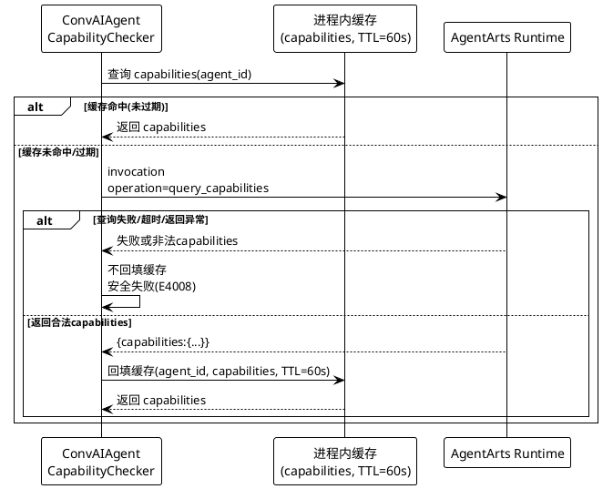
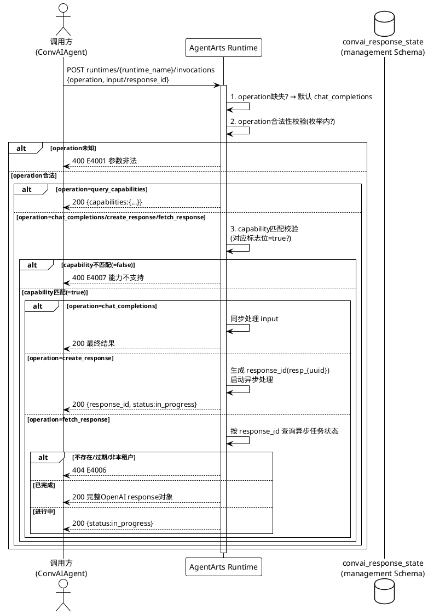
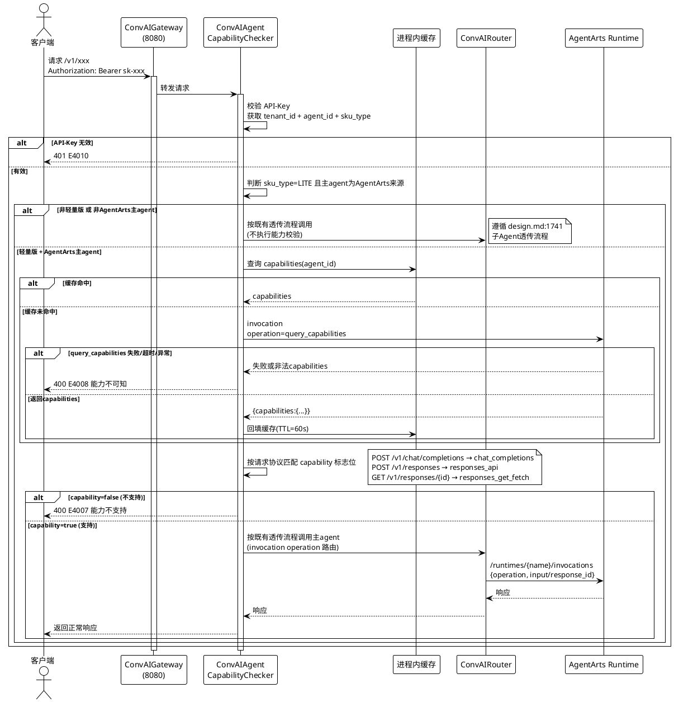
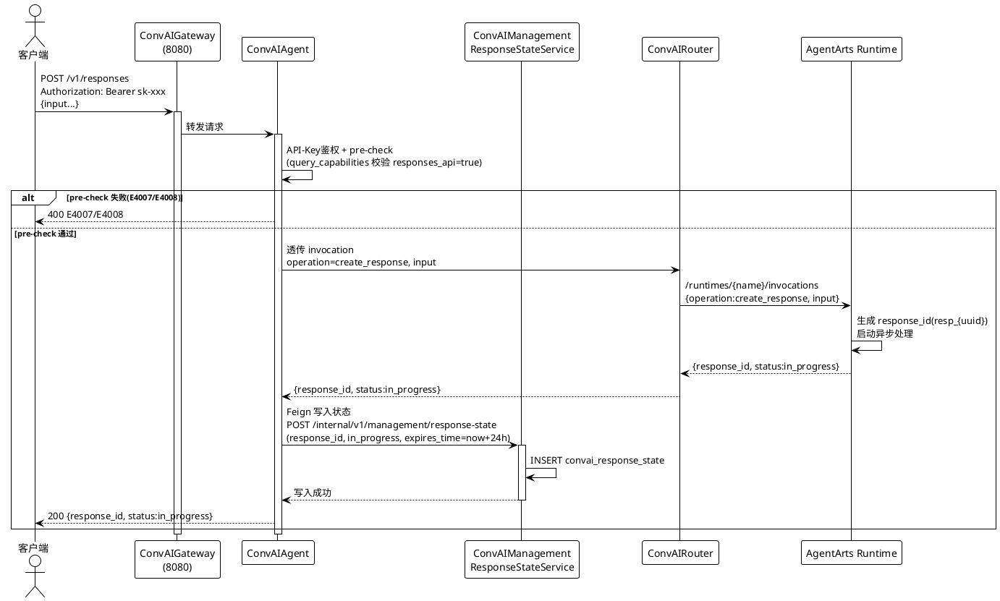
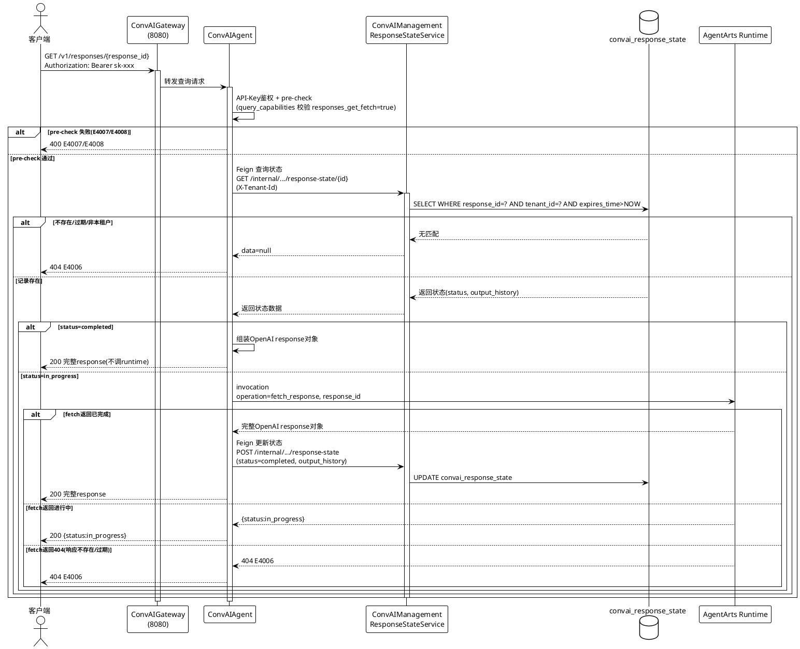

# FE2026081400138 独立Agent运行时接口规则 Design 增量设计

> 本文档描述对 DESIGN.md 的增量变更，使用 ADDED/MODIFIED/REMOVED 标记。
> 本次变更基于 delta-spec.md（FE2026081400138）定义的业务规则，将其转化为可实施的技术方案，并联动修订 0096（FE2026081400096）delta-design 中元数据持久化与能力校验的模块/接口/流程设计。
> 完成后需合并到全量 DESIGN.md 中。

---

## 1. 设计背景

### 1.1 设计目标

将 AgentArts 部署的独立 agent（垂域 agent）的单一运行时执行接口 `runtimes/{runtime_name}/invocations` 扩展为支持能力查询（query_capabilities）与多协议路由（operation）的统一运行时接口，并在平台侧（convai-agent）将能力前置校验从"读持久化元数据"改为"运行时 query_capabilities 实时查询"，删除 0096 的元数据持久化机制。

### 1.2 设计约束

1. **数据库隔离约束**（design.md 2.9）：convai_response_state 表归属 convai_management Schema（0096 delta-design 3.2 已明确），ConvAIAgent 跨服务读写须通过 Feign Client（ManagementFeignClient）调用内部接口；AgentArtsRuntime 为外部服务，不得直接访问 convai_management Schema。
2. **runtime 外部调用约束**：AgentArtsRuntime 经 SNAT/EIP 访问（design.md 2.6 部署架构 `EIP2 → AgentArts`），query_capabilities 与 invocation 透传均为跨网络外部调用，延迟高于 0096 原 Feign 读本地 management 库。
3. **复用认证与路由**：平台对外接口（POST /v1/responses、GET /v1/responses/{response_id}）复用 FE2026072300156 / 0096 的 API-Key Bearer 认证与 ConvAIGateway 8080 路由，不引入新认证方式。
4. **向后兼容**：invocation 无 operation 仅 input 时默认 chat_completions，既有调用链路（design.md:1699 实时语音流、design.md:1761 轻量版透传流）零改造。
5. **能力校验范围**：仅轻量版智能体（sku_type=LITE）配置 AgentArts 主 agent 时触发能力校验，全能版（STANDARD）不触发（沿用 0096 约束）。
6. **安全失败**：query_capabilities 调用失败/超时/返回异常时，能力校验拒绝调用（不放行），返回 E4008。

### 1.3 非目标

- 不改动 4 个垂域 agent（拍照问答/文旅导览/录音转写/mobile use）在 AgentArtsRuntime 内部的业务实现（各 agent FE 负责）
- 不改动平台 POST /v1/responses、GET /v1/responses/{response_id} 接口的对外契约（FE2026072300156 / 0096 F-01 已定义，本 FE 仅修订其内部透传与状态同步流程）
- 不改动 convai_response_state 表结构（0096 / FE2026072300156 已定义）
- 不做 subagent 能力校验（subagent 能力声明仅作路由依据）
- 不做主-subagent 智能路由选择（仅能力门禁）

---

## 2. 设计决策

### 2.1 query_capabilities 缓存策略

**决策**：ConvAIAgent 进程内缓存主 agent 的 capabilities，TTL 约 60s（可配置），缓存未命中时调 invocation query_capabilities 实时查询并回填缓存。

**背景**：0138 将 pre-check 从"Feign 读 convai_management 的 agent_metadata"改为"调 AgentArtsRuntime query_capabilities"。后者为经 SNAT/EIP 的外部调用，延迟（~几十至数百 ms）高于 0096 原 Feign 读本地库（~10-50ms）。若每次调用都实时查询，pre-check 延迟将超出 proposal DFX 目标（P99 ≤50ms）。

**方案对比**：

| 方案 | 优点 | 缺点 |
|------|------|------|
| 进程内缓存+短TTL（采纳） | 缓存命中 P99 ≤5ms；无额外依赖；capabilities 为静态声明，短TTL不一致窗口可接受 | capabilities 变更（部署新版）在 TTL 内不立即生效 |
| 不缓存实时查询 | 强一致，能力变更即时生效 | 每次调用增加外部 runtime 网络开销，P99 可能 >50ms，超出 DFX 目标 |
| Redis缓存+部署失效通知 | 性能最优；可跨实例共享 | 引入缓存失效消息机制与一致性窗口，系统复杂度高 |

**理由**：
- capabilities 是 agent 的静态能力声明，运行期间不变，仅在部署新版本时可能变更，短 TTL（60s）不一致窗口业务可接受
- 进程内缓存无额外中间件依赖，实现简单，缓存命中时延迟极低（内存读取），满足 pre-check P99 ≤50ms（命中 ≤5ms，未命中 ≤200ms 含 runtime 调用）
- 部署新版本后需立即生效的场景，可通过运维手段（重启实例或缩短 TTL）处理，不引入消息机制复杂度

**缓存设计**：
- 缓存 Key：`agent_id`（主 agent 唯一标识，租户隔离由 agent_id 本身保证）
- 缓存 Value：capabilities 对象 `{chat_completions, responses_api, responses_get_fetch}`
- TTL：60s（配置项 `convai.capability.cache.ttl`）
- 缓存未命中：调 invocation query_capabilities，成功后回填缓存；失败不回填缓存，返回 E4008（安全失败）
- 缓存失效：自然过期；部署新版本后如需立即生效，重启实例或手动清缓存

### 2.2 response_id 生成归属

**决策**：AgentArtsRuntime 在 invocation create_response 时生成 response_id（格式 `resp_{uuid}`，见 5.11.1）并返回；ConvAIAgent 收到后通过 Feign 调用 ConvAIManagement 写入 convai_response_state。

**背景**：create_response 产生的 response_id 必须能被平台 GET /v1/responses/{response_id}（5.15）查询到，即必须落入 convai_response_state。需明确 response_id 由谁生成。

**方案对比**：

| 方案 | 优点 | 缺点 |
|------|------|------|
| runtime 生成（采纳） | runtime 是响应实际创建者，id 由其生成更内聚；与 5.11.1 格式约束解耦；runtime 内部可用 response_id 关联异步任务 | 平台需从 runtime 返回中提取 response_id 并落库 |
| 平台生成传入 runtime | 平台掌控 id 生成规则与格式 | 平台需感知 runtime 创建时序；runtime 需接受外部传入 id 并关联任务，耦合反向 |

**理由**：
- AgentArtsRuntime 是异步响应的实际创建者与处理者，response_id 由其生成可自然关联内部异步任务状态，内聚性更高
- ConvAIAgent 作为透传与状态同步层，从 runtime 返回结果提取 response_id 并通过 Feign 写入 convai_response_state，职责清晰
- response_id 格式约束（`resp_{uuid}`）由 spec 5.11.1 统一约束，runtime 生成时遵循即可，平台无需参与生成

**影响**：ConvAIAgent 在 create_response 透传成功后，需新增一步"通过 Feign 写入 convai_response_state"（见 4.5 新增内部接口）。

### 2.3 异步响应状态同步机制

**决策**：平台处理 GET /v1/responses/{response_id} 查询时，若 convai_response_state 状态为 in_progress，ConvAIAgent 调 invocation fetch_response 获取 runtime 最新状态；若已完成则更新 convai_response_state 落库再返回，若仍 in_progress 则返回进行中状态。runtime 无需反向回调平台。

**背景**：create_response 创建异步响应后，runtime 异步处理，完成后的完整 OpenAI response 对象需进入 convai_response_state 供平台 GET 查询返回。需明确完成状态如何同步。

**方案对比**：

| 方案 | 优点 | 缺点 |
|------|------|------|
| GET 时按需 fetch 刷新（采纳） | 调用方向与既有透传一致（平台→runtime），runtime 无需反向回调；仅在实际查询时才触发刷新，无空转 | GET 查询 in_progress 时增加一次 runtime 调用 |
| runtime 完成后回调平台写入 | GET 查询仅读本地，不调 runtime | 需 runtime 支持反向回调（webhook），引入回调链路与可靠性依赖；runtime 为外部服务，回调平台增加耦合 |
| runtime 直写 convai_response_state | 无中间转发 | runtime 为外部服务，跨库访问违反 design.md 2.9 数据库隔离约束，不可行 |

**理由**：
- "GET 时按需 fetch"保持调用方向一致性（ConvAIAgent → AgentArtsRuntime），与既有透传流程同构，不引入反向回调链路
- runtime 作为外部服务不支持反向回调平台，避免增加 webhook 可靠性依赖与跨服务耦合
- 仅在实际查询时触发 fetch 刷新，无异步空转；已完成响应首次 GET 后落库，后续 GET 直接命中本地，减少 runtime 调用
- 方案 C 违反数据库隔离约束，直接排除

**影响**：ConvAIAgent 的 GET 查询流程需修订（见 5.5），增加 in_progress 时的 fetch_response 刷新与落库更新逻辑。

### 2.4 operation 路由分发实现位置

**决策**：operation 路由分发在 AgentArtsRuntime 内部实现（agent 侧，各 agent FE 负责）；ConvAIAgent 侧（平台）在透传调用 invocation 时，按客户端请求协议设置 operation 参数，不参与 operation 内部路由。

**背景**：invocation 接口归属 AgentArtsRuntime（外部），operation 路由是其内部行为。需明确平台侧的职责边界——平台设置 operation，runtime 路由分发。

**平台侧 operation 映射**（ConvAIAgent 透传时设置）：

| 客户端请求协议 | invocation operation | 必填参数 |
|----------------|----------------------|----------|
| POST /v1/chat/completions | chat_completions | input |
| POST /v1/responses | create_response | input |
| GET /v1/responses/{response_id}（in_progress 刷新） | fetch_response | response_id |
| （无 operation，仅 input） | 默认 chat_completions | input |

**理由**：
- operation 路由是 runtime 的内部行为，由各 agent 在 runtime 内实现（query_capabilities / chat_completions / create_response / fetch_response 分发），平台不干预
- 平台侧职责为"按请求协议设置 operation 参数并透传"，映射规则固定且与 spec 5.18.1 规则 2 一致
- 既有调用链路（实时语音流、轻量版透传流）不传 operation，runtime 默认 chat_completions，零改造

### 2.5 invocation 路径统一

**决策**：统一 invocation 接口路径为 `runtimes/{runtime_name}/invocations`（尾缀 s），修正 design.md 现存路径不一致。

**背景**：design.md 现存路径不一致——design.md:1699 为 `/runtimes/{runtime_name}/invocation`（无 s，实时语音流/全能版），design.md:1761 为 `/runtimes/{runtime_name}/invocations`（有 s，轻量版透传流）。AgentArts runtime 实际接口路径为 `invocations`（有 s），故统一采用有 s 形式。

**理由**：以 AgentArts runtime 实际接口为准，统一为 `invocations`（有 s），design.md 合并时修正 :1699 处的 `invocation` → `invocations`，消除路径歧义。

> 注：proposal.md / delta-spec.md 中 `runtimes/{runtime_name}/invocation`（无 s）需同步修正为 `invocations`（有 s），保持文档链一致（见 11 待解决问题）。

---

## 3. 数据模型变更

### 3.1 REMOVED convai_agent 表字段扩展（撤销 0096 新增）

**撤销 0096 delta-design 2.5 / 3.1**：0096 拟对 convai_agent 表新增的 `agent_metadata` / `subagent_metadata` 两个 TEXT 字段本次不新增，表结构维持基线（无该两个字段）。

**撤销 DDL**（0096 拟执行，本次不执行）：
```sql
-- 0096 拟新增，0138 撤销，不执行
-- ALTER TABLE convai_agent
--   ADD COLUMN agent_metadata TEXT COMMENT '主agent元数据JSON',
--   ADD COLUMN subagent_metadata TEXT COMMENT 'subagent元数据列表JSON';
```

**理由**：能力获取改为运行时 query_capabilities 实时返回，不持久化到 convai_agent 表。0096 与 0138 均未合并基线，convai_agent 表实际未新增该字段，撤销无迁移成本。

### 3.2 MODIFIED convai_response_state 表归属与读写（复用 0096，无结构变更）

**表结构**：不变，沿用 FE2026072300156 / 0096 既有定义（response_id / tenant_id / agent_id / is_pass_through / input_history / output_history / status / expires_time 等）。

**归属**：convai_management Schema（0096 delta-design 3.2 已明确），ConvAIAgent 通过 Feign 读写。

**0138 新增读写场景**：

| 场景 | 操作 | 触发时机 |
|------|------|----------|
| create_response 状态写入 | INSERT（response_id, in_progress, expires_time=now+24h） | ConvAIAgent 透传 invocation create_response 成功后 |
| fetch_response 状态更新 | UPDATE（status=completed, output_history） | ConvAIAgent 处理 GET 查询时 fetch_response 返回已完成 |
| GET 查询读取 | SELECT（response_id + tenant_id + expires_time） | GET /v1/responses/{response_id} 查询（0096 既有，不变） |

> 0096 delta-design 已定义 ResponseStateService 的 getResponseState / saveResponseState 方法与 GET 查询内部接口。0138 补充 saveResponseState 的对外内部接口（见 4.5），供 create_response 写入与 fetch_response 更新调用。

### 3.3 ADDED capabilities 对象（非持久化，runtime 内存静态声明）

**承载方式**：capabilities 对象不持久化到任何表，由 AgentArtsRuntime 在进程内静态声明，通过 query_capabilities operation 返回。

**结构**（与 spec 6.12 一致）：

| 字段 | 类型 | 约束 | 说明 |
|------|------|------|------|
| chat_completions | boolean | 必填 | 是否支持同步对话 |
| responses_api | boolean | 必填 | 是否支持异步创建响应 |
| responses_get_fetch | boolean | 必填 | 是否支持查询异步响应；为 true 时 responses_api 必须 true |

**能力依赖校验时机**：runtime 在启动/部署时自检 capabilities 声明，若 `responses_get_fetch=true` 但 `responses_api=false` 则拒绝上线（spec 5.18.1 规则 6）；query_capabilities 返回前不再运行时校验（声明已在部署时保证合法）。

---

## 4. 接口设计变更

### 4.1 MODIFIED runtimes/{runtime_name}/invocations（AgentArtsRuntime 接口，0138 定义规范）

**功能**：独立 agent 统一运行时执行接口，扩展 operation 字段路由与 query_capabilities 元操作

**所属模块**：AgentArtsRuntime（agent 侧，各 agent FE 实现）

**路径**：`runtimes/{runtime_name}/invocations`（统一带尾缀 s，合并时修正 design.md:1699 不一致）

**请求**：
```json
{
  "operation": "query_capabilities|chat_completions|create_response|fetch_response",
  "input": "调用输入（chat_completions/create_response 时必填）",
  "response_id": "resp_xxx（fetch_response 时必填）"
}
```

**operation 路由规则**：

| operation 值 | 行为 | 必填参数 | 响应 |
|--------------|------|----------|------|
| query_capabilities | 返回 capabilities 对象 | 无 | `{capabilities:{chat_completions, responses_api, responses_get_fetch}}` |
| chat_completions | 同步对话 | input | 最终结果 |
| create_response | 异步创建响应 | input | `{response_id, status:in_progress}` |
| fetch_response | 查询异步响应 | response_id | 完整 OpenAI response 对象（已完成）或 `{status:in_progress}` |
| （无 operation） | 默认 chat_completions | input | 最终结果（向后兼容） |

**runtime 双层校验**（路由前执行）：

| 校验项 | 失败响应 |
|--------|----------|
| operation 为未知枚举值 | 400 E4001 参数非法 |
| operation 合法但超出声明 capability | 400 E4007 能力不支持 |
| fetch_response 缺失 response_id | 400 E4001 参数非法 |
| fetch_response 的 response_id 不存在/过期/非本租户 | 404 E4006 响应不存在或已过期 |

**向后兼容说明**：无 operation 仅 input 的请求默认 chat_completions，既有调用链路（design.md:1699 实时语音流、design.md:1761 轻量版透传流）行为不变。

### 4.2 MODIFIED GET /v1/responses/{response_id}（0096 定义，0138 修订内部流程）

**对外契约**：不变（路径、认证、请求/响应格式、错误码沿用 0096 4.1）。

**内部流程修订**：GET 查询时，若 convai_response_state 状态为 in_progress，ConvAIAgent 调 invocation fetch_response 刷新状态（见 5.5 流程）。

**修订点**：
- 0096 原流程：ConvAIAgent → Feign 查 ConvAIManagement → 直接返回（不调 runtime）
- 0138 修订流程：ConvAIAgent → Feign 查 ConvAIManagement → 若 in_progress → 调 invocation fetch_response → 若已完成则更新落库 → 返回

### 4.3 MODIFIED POST /v1/responses（FE2026072300156 定义，0138 修订轻量版透传流程）

**对外契约**：不变（路径、认证、请求/响应格式沿用 FE2026072300156）。

**内部流程修订**（仅轻量版+AgentArts主agent场景）：
- pre-check 通过后，ConvAIAgent 调 invocation（operation=create_response）透传
- runtime 返回 response_id + in_progress
- ConvAIAgent 通过 Feign 调 ConvAIManagement 写入 convai_response_state（见 4.5）
- ConvAIAgent 返回客户端 response_id + in_progress

> 全能版或非 AgentArts 主 agent 场景，POST /v1/responses 仍走 FE2026072300156 既有流程，不经 invocation。

### 4.4 REMOVED GET /internal/v1/management/agents/{agent_id}/metadata（0096 内部接口，0138 删除）

**删除原因**：pre-check 不再从 ConvAIManagement 读取持久化 agent_metadata，改为调 AgentArtsRuntime query_capabilities。该内部接口无调用方，删除。

**删除范围**：
- ConvAIManagement 侧 AgentMetadataService 的查询接口与实现（见 6.2）
- ConvAIAgent 侧 ManagementFeignClient 的 getAgentMetadata 声明（见 6.1）

### 4.5 ADDED POST /internal/v1/management/response-state（内部接口，状态写入/更新）

**功能**：ConvAIAgent 通过 Feign 调用 ConvAIManagement 写入或更新 convai_response_state 记录，供 create_response 写入与 fetch_response 刷新使用。

**所属模块**：ConvAIManagement（convai-management）ResponseStateService（0096 已定义服务，本次补对外内部接口）

**请求**：
```http
POST /internal/v1/management/response-state
X-Tenant-Id: {tenant_id}
Content-Type: application/json
```
```json
{
  "response_id": "resp_xxx",
  "agent_id": "agent-xxx",
  "is_pass_through": true,
  "input_history": "{...}",
  "output_history": "{...}",
  "status": "in_progress",
  "expires_time": "2026-08-15T14:00:00+08:00"
}
```

**响应**：
```json
{ "code": 0, "message": "success" }
```

**说明**：
- create_response 后首次写入：status=in_progress，expires_time=now+24h，output_history 为空
- fetch_response 刷新后更新：status=completed，output_history=完整 OpenAI response output
- 主键冲突（response_id 已存在）时按 UPDATE 语义处理（幂等）

### 4.6 REMOVED agent 管理接口 agent_metadata/subagent_metadata 字段支持（撤销 0096 扩展）

**撤销 0096 delta-design 4.2**：POST /v1/agents / PATCH /v1/agents/{id} / GET /v1/agents/{id} 不再支持 agent_metadata / subagent_metadata 字段的保存与查询。

**撤销范围**：
- agent 管理接口的 agent_metadata / subagent_metadata 字段接收/返回
- 一致性校验逻辑（capabilities ↔ supported_apis）与错误码 E4009 的触发场景

> E4009（元数据能力声明不一致）随元数据持久化机制删除而不再触发，错误码编号保留但不产生（见 7.1）。

---

## 5. 流程设计

### 5.1 query_capabilities 能力查询流程（含缓存）



**流程说明**：
1. CapabilityChecker 先查进程内缓存（Key=agent_id）
2. 缓存命中且未过期 → 直接返回，P99 ≤5ms
3. 缓存未命中 → 调 invocation query_capabilities
4. 查询失败/超时/返回异常 → 不回填缓存，抛出 E4008（安全失败，不放行）
5. 查询成功 → 回填缓存（TTL 60s），返回 capabilities

### 5.2 invocation operation 路由流程（runtime 侧）



**流程说明**：
1. operation 缺失 → 默认 chat_completions（向后兼容）
2. operation 合法性校验：未知枚举值 → E4001
3. query_capabilities 为元操作，直接返回 capabilities，不做 capability 校验
4. 其余 operation 做 capability 匹配校验：不匹配 → E4007
5. create_response：runtime 生成 response_id（resp_{uuid}），启动异步处理，返回 in_progress
6. fetch_response：runtime 按 response_id 查询异步任务，返回完整 response / in_progress / 404

> 注：runtime 侧的 convai_response_state 读写由 ConvAIAgent 侧通过 Feign 完成（runtime 不直接访问 management Schema）。runtime 内部维护异步任务状态，fetch_response 返回的响应由 ConvAIAgent 落库。

### 5.3 修订后能力前置校验流程（pre-check 改用 query_capabilities）



**流程说明**：
1. ConvAIAgent 校验 API-Key 后，判断 sku_type=LITE 且主 agent 为 AgentArts 来源
2. 非轻量版或非 AgentArts 主 agent → 按既有透传流程（design.md:1741），不执行能力校验
3. 轻量版 + AgentArts 主 agent → 先查进程内缓存 capabilities
4. 缓存未命中 → 调 invocation query_capabilities；失败/超时/异常 → E4008（安全失败，不放行）
5. 查询成功 → 回填缓存（TTL 60s）
6. 按请求协议映射 capability 标志位校验：false → E4007；true → 按既有透传流程调用主 agent invocation（operation 路由）
7. 校验失败时不发起透传调用（不调用 AgentArtsRuntime）

**与 0096 原流程差异**：
- 0096：AIAgent → Feign → ConvAIManagement → 读 convai_agent.agent_metadata
- 0138：AIAgent → 进程内缓存 / → invocation query_capabilities → AgentArtsRuntime

### 5.4 create_response 异步创建与状态写入流程



**流程说明**：
1. 客户端 POST /v1/responses，经网关转发至 ConvAIAgent
2. ConvAIAgent pre-check（query_capabilities 校验 responses_api=true）
3. pre-check 通过 → 透传 invocation（operation=create_response）
4. AgentArtsRuntime 生成 response_id（resp_{uuid}），启动异步处理，返回 in_progress
5. ConvAIAgent 通过 Feign 调 ConvAIManagement 写入 convai_response_state（response_id, in_progress, expires_time=now+24h）
6. ConvAIAgent 返回客户端 response_id + in_progress

### 5.5 GET 查询时按需 fetch_response 刷新流程



**流程说明**：
1. 客户端 GET /v1/responses/{response_id}，经网关转发至 ConvAIAgent
2. ConvAIAgent pre-check（query_capabilities 校验 responses_get_fetch=true）
3. pre-check 通过 → Feign 查 ConvAIManagement 的 convai_response_state
4. 不存在/过期/非本租户 → 404 E4006
5. status=completed → 直接组装 OpenAI response 对象返回（不调 runtime）
6. status=in_progress → 调 invocation fetch_response 刷新：
   - runtime 返回已完成 → 更新 convai_response_state 落库（status=completed, output_history）→ 返回完整 response
   - runtime 返回进行中 → 返回 in_progress 状态（不更新落库）
   - runtime 返回 404 → 返回 404 E4006（响应在 runtime 侧已失效）

**与 0096 原流程差异**：
- 0096：GET 查询仅读 convai_response_state，不调 runtime
- 0138：GET 查询 in_progress 时调 invocation fetch_response 刷新，已完成则落库更新

---

## 6. 模块设计

### 6.1 ConvAIAgent（convai-agent）修改模块

#### CapabilityChecker（修订，0096 新增）

**职责变更**：轻量版智能体调用主 agent 前的能力前置校验，能力获取方式从"Feign 读 convai_management 的 agent_metadata"改为"进程内缓存 + invocation query_capabilities"。

**修订点**：
- 删除：Feign 调用 `GET /internal/v1/management/agents/{agent_id}/metadata` 读取 agent_metadata
- 新增：进程内 capabilities 缓存（Key=agent_id, TTL=60s）
- 新增：缓存未命中时调 invocation query_capabilities，成功回填缓存，失败抛 E4008
- 保留：按请求协议映射 capability 标志位校验（chat_completions / responses_api / responses_get_fetch），false 抛 E4007

**请求协议枚举**（沿用 0096）：
- CHAT_COMPLETIONS（POST /v1/chat/completions → chat_completions）
- RESPONSES_API（POST /v1/responses → responses_api）
- RESPONSES_GET_FETCH（GET /v1/responses/{id} → responses_get_fetch）

#### AgentInvocationClient（修订，既有透传调用模块）

**职责变更**：透传调用 invocation 时，按客户端请求协议设置 operation 参数。

**修订点**：
- 既有透传调用（design.md:1741 子Agent透传流程）增加 operation 参数设置
- 协议→operation 映射：POST /v1/chat/completions → chat_completions；POST /v1/responses → create_response；GET 刷新 → fetch_response
- 无 operation 的既有调用链路（实时语音流、轻量版透传流）不传 operation，runtime 默认 chat_completions，行为不变

#### ResponseService（修订，FE2026072300156 / 0096 已有）

**职责变更**：
- GET 查询：新增 in_progress 时的 fetch_response 刷新与落库更新逻辑（见 5.5）
- POST 创建（轻量版+AgentArts主agent）：新增 create_response 透传与 convai_response_state 写入逻辑（见 5.4）

**修订点**：
- GET 路径：status=in_progress 时调 invocation fetch_response，已完成则 Feign 更新 convai_response_state
- POST 路径：透传 invocation create_response 成功后，Feign 写入 convai_response_state（response_id, in_progress, expires_time）

#### ManagementFeignClient（修订，已有）

**职责变更**：删除 agent_metadata 查询声明，新增 response-state 写入声明。

**修订点**：
- 删除：`GET /internal/v1/management/agents/{agentId}/metadata`（getAgentMetadata）—— 不再有调用方
- 新增：`POST /internal/v1/management/response-state`（saveResponseState）—— 供 create_response 写入与 fetch_response 更新
- 保留：`GET /internal/v1/management/response-state/{responseId}`（getResponseState）—— GET 查询沿用 0096

### 6.2 ConvAIManagement（convai-management）模块变更

#### AgentMetadataService（删除，0096 新增）

**删除原因**：元数据持久化机制被 query_capabilities 取代，agent_metadata / subagent_metadata 字段撤销，元数据查询与保存服务无存在意义。

**删除范围**：
- getAgentMetadata / saveAgentMetadata 方法及实现
- capabilities ↔ supported_apis 一致性校验逻辑
- 对应内部接口 `GET /internal/v1/management/agents/{agent_id}/metadata`（见 4.4）

#### ResponseStateService（不变，复用 0096）

**职责**：convai_response_state 表的读写服务（0096 delta-design 6.2 已定义）。

**0138 新增调用场景**：
- saveResponseState：被 ConvAIAgent 在 create_response 写入与 fetch_response 更新时调用（通过 4.5 新增内部接口）
- getResponseState：GET 查询沿用 0096，不变

#### Agent 管理接口（撤销 0096 扩展）

**撤销**：POST /v1/agents / PATCH /v1/agents/{id} / GET /v1/agents/{id} 不再支持 agent_metadata / subagent_metadata 字段（见 4.6）。

### 6.3 AgentArtsRuntime（agent 侧，规格约束）

> 以下为对 agent 侧的接口规格约束，具体实现由各 agent FE 负责，本设计仅定义必须遵循的模块职责。

#### operation 路由分发器（新增约束）

**职责**：在 invocation 接口上按 operation 字段路由到对应协议处理逻辑，路由前执行双层校验（operation 合法性 + capability 匹配）。

**约束**：
- 必须支持 operation 取值：query_capabilities / chat_completions / create_response / fetch_response
- 无 operation 仅 input 时默认 chat_completions
- 未知 operation → 400 E4001；capability 不匹配 → 400 E4007；fetch_response 缺 response_id → 400 E4001

#### query_capabilities 处理（新增约束）

**职责**：返回进程内静态声明的 capabilities 对象。

**约束**：
- 返回且仅返回 `{capabilities:{chat_completions, responses_api, responses_get_fetch}}`
- 不做能力校验、无业务副作用
- 所有独立 agent 必须支持

#### create_response / fetch_response 处理（新增约束）

**职责**：
- create_response：生成 response_id（resp_{uuid}），启动异步处理，返回 in_progress
- fetch_response：按 response_id 返回异步任务最新状态（完整 response / in_progress / 404）

**约束**：
- create_response 由 runtime 生成 response_id（见 2.2 决策）
- fetch_response 的 response_id 不存在/过期/非本租户 → 404 E4006
- 异步任务状态由 runtime 内部维护，ConvAIAgent 侧通过 Feign 落库 convai_response_state

---

## 7. 错误处理设计

### 7.1 错误码语义变更

| 错误码 | HTTP状态码 | 0096 语义（原） | 0138 语义（修订后） | 触发场景 |
|--------|-----------|----------------|---------------------|----------|
| E4001 | 400 | 参数非法 | 参数非法（不变） | operation 未知枚举值；fetch_response 缺 response_id |
| E4006 | 404 | 响应不存在或过期 | 响应不存在或过期（不变） | fetch_response 时 response_id 不存在/过期(>24h)/非本租户 |
| E4007 | 400 | 能力不支持 | 能力不支持（不变） | operation 超出声明 capability（runtime 双层校验 + 平台 pre-check） |
| E4008 | 400 | 能力不支持（元数据缺失） | **能力不可知**（语义变更） | query_capabilities 调用失败/超时/返回异常/返回空 capabilities |
| E4009 | 400 | 元数据能力声明不一致 | **不再触发**（撤销） | 随元数据持久化与一致性校验删除，错误码编号保留但不产生 |

> E4008 语义从"元数据缺失"变更为"query_capabilities 失败/超时/返回异常"，与 spec 5.17.1 规则 3 一致。E4009 随 0096 元数据机制删除而不再触发。

### 7.2 query_capabilities 调用异常处理

| 场景 | 处理 |
|------|------|
| AgentArtsRuntime 不可达（网络故障） | 不回填缓存，pre-check 安全失败，返回 E4008 |
| query_capabilities 超时 | 同上，安全失败，返回 E4008 |
| query_capabilities 返回空/非法 capabilities | 同上，安全失败，返回 E4008 |
| fetch_response 超时 | GET 查询返回 500（上游超时），不更新 convai_response_state |

**安全失败原则**：query_capabilities 失败时采用"安全失败"策略——拒绝调用主 agent（E4008），不回填缓存，避免在能力未知时透传调用。

### 7.3 缓存一致性异常处理

| 场景 | 处理 |
|------|------|
| capabilities 变更（部署新版）后缓存未过期 | TTL 内返回旧 capabilities，可能短暂放行/拒绝不一致；60s 后自动刷新；如需立即生效，重启实例或手动清缓存 |
| 缓存与 runtime 实际能力短暂不一致 | capabilities 为静态声明，运行期不变，仅在部署时变更，不一致窗口 ≤60s，业务可接受 |

### 7.4 错误响应格式

沿用 0096 / FE2026072300156 格式：
```json
{
  "error": {
    "code": "E4008",
    "message": "能力不可知",
    "type": "capability_unknown"
  }
}
```

---

## 8. 配置设计

### 8.1 新增/修订配置项

| 配置项 | 说明 | 示例值 |
|--------|------|--------|
| convai.capability.cache.ttl | capabilities 进程内缓存 TTL（毫秒） | 60000（60s） |
| convai.capability.cache.enabled | 是否启用 capabilities 缓存 | true |
| convai.runtime.invocation.timeout | invocation 透传调用超时（毫秒，含 query_capabilities/create_response/fetch_response） | 30000 |
| convai.runtime.query-capabilities.timeout | query_capabilities 单独超时（毫秒，pre-check 用，短超时快速失败） | 3000 |

> 0096 的 `convai.management.feign.agent-metadata.timeout` 随 agent_metadata 接口删除而废弃；`convai.management.feign.response-state.timeout` 沿用。

---

## 9. DFX 修正

### 9.1 对 proposal / 0096 DFX 的修正

| 约束项 | proposal/0096 指标 | 0138 修正后指标 | 修正原因 |
|--------|-------------------|----------------|----------|
| 能力校验延迟（缓存命中） | 0096: P99 ≤50ms（Feign 跨服务） | P99 ≤5ms（进程内缓存命中） | 0138 改用进程内缓存，命中时内存读取 |
| 能力校验延迟（缓存未命中） | — | P99 ≤200ms（含 invocation query_capabilities 外部调用） | 缓存未命中时经 SNAT/EIP 调 AgentArtsRuntime，外部调用延迟较高 |
| query_capabilities 响应时间 | proposal: P99 ≤200ms | P99 ≤200ms（不变） | runtime 内返回静态能力声明 |
| operation 路由开销 | proposal: <5ms | <5ms（不变） | runtime 内按 operation 分发 |
| GET 查询响应时间（in_progress） | 0096: P99 ≤500ms | P99 ≤500ms（含 fetch_response 刷新） | in_progress 时增加一次 invocation 调用，但 query_capabilities 已缓存，fetch_response 走既有透传通道 |

### 9.2 新增 DFX 约束

| 约束项 | 指标 | 优先级 |
|--------|------|--------|
| query_capabilities 超时 | 3s 超时快速失败，安全失败返回 E4008 | P0 |
| 缓存命中率 | 正常运行期（无部署变更）缓存命中率 ≥99%（60s TTL 内仅首次未命中） | P1 |
| 向后兼容 | 无 operation 仅 input 调用行为不变 | P0 |
| 能力校验安全失败 | query_capabilities 失败时拒绝调用（不放行） | P0 |

---

## 10. 风险与缓解

| 风险 | 可能性 | 影响 | 缓解措施 |
|------|--------|------|----------|
| capabilities 缓存 TTL 内与 runtime 实际能力不一致 | 中 | 低 | capabilities 为静态声明，仅部署时变更；TTL 60s 不一致窗口业务可接受；部署后需立即生效可重启实例 |
| query_capabilities 外部调用延迟波动（SNAT/EIP 网络抖动） | 中 | 中 | 3s 超时快速失败 + 安全失败（E4008）；进程内缓存屏蔽大部分调用（命中率 ≥99%）；仅首次未命中或 TTL 过期时承受外部延迟 |
| AgentArtsRuntime 不可达导致 pre-check 全部失败 | 低 | 高 | 安全失败策略返回 E4008 不放行；AgentArts 高可用部署；缓存已命中的 agent 在 runtime 不可达时仍可校验（但透传仍会失败，由透传超时兜底） |
| GET 查询 in_progress 时 fetch_response 增加 runtime 调用，可能放大查询延迟 | 中 | 中 | fetch_response 走既有透传通道（30s 超时）；已完成响应首次 GET 后落库，后续 GET 直接命中本地；P99 ≤500ms 目标不变 |
| create_response 后 ConvAIAgent 写入 convai_response_state 失败（Feign 异常） | 低 | 中 | 写入失败时 response_id 已返回客户端但本地无记录，GET 查询将返回 404；可通过重试或异步补偿写入缓解；列入待解决问题 |
| 0096 已部分实现元数据持久化，需回滚 | 中 | 中 | 0096 与 0138 均未合并基线；若 0096 已实现 AgentMetadataService / agent_metadata 字段，需回滚删除；列入影响分析 |
| design.md invocation 路径不一致（:1699 invocation vs :1761 invocations） | 高 | 低 | 合并时统一为 invocations（有 s），修正 :1699 |

---

## 11. 待解决问题

- [ ] AgentArtsRuntime 的 invocation 接口扩展（operation 字段、query_capabilities、create_response/fetch_response）由各 agent FE 实现，需确认 4 个垂域 agent（拍照问答/文旅导览/录音转写/mobile use）的实现排期与接口一致性
- [ ] create_response 后 ConvAIAgent 写入 convai_response_state 的 Feign 调用失败时，是否需引入异步补偿写入机制（如重试队列），待联调评估写入失败率后决策
- [ ] GET 查询 in_progress 时 fetch_response 返回 404（runtime 侧响应已失效但 convai_response_state 仍有 in_progress 记录）的处理策略：是否同步删除本地记录或仅返回 404，待联调评估
- [ ] capabilities 缓存是否需支持运维手动失效接口（如部署新版本后主动清缓存），还是仅依赖 TTL 过期与重启，待运维需求确认
- [ ] 0096 若已部分实现 AgentMetadataService / convai_agent.agent_metadata 字段 / 内部 metadata 接口，需确认回滚范围与联调验证
- [ ] proposal.md / delta-spec.md 中 `runtimes/{runtime_name}/invocation`（无尾缀 s）需同步修正为 `runtimes/{runtime_name}/invocations`（带尾缀 s），保持文档链路径一致（design.md:1699 同步修正）

---

## 合并检查清单

- [ ] MODIFIED runtimes/{runtime_name}/invocations 接口规范已添加到 DESIGN.md（operation 路由 + query_capabilities + 双层校验）
- [ ] design.md:1699 路径 invocation → invocations 统一修正
- [ ] MODIFIED GET /v1/responses/{response_id} 内部流程修订（in_progress 时 fetch_response 刷新）已更新到 DESIGN.md 第5节
- [ ] MODIFIED POST /v1/responses 轻量版透传流程修订（create_response + 状态写入）已更新到 DESIGN.md 第5节
- [ ] REMOVED GET /internal/v1/management/agents/{agent_id}/metadata 内部接口已从 DESIGN.md 删除
- [ ] ADDED POST /internal/v1/management/response-state 内部接口（状态写入/更新）已添加到 DESIGN.md 第4节
- [ ] REMOVED agent 管理接口 agent_metadata/subagent_metadata 字段支持已从 DESIGN.md 撤销
- [ ] REMOVED convai_agent 表 agent_metadata/subagent_metadata 字段（撤销 0096 新增，不执行 DDL）
- [ ] 模块设计修订已更新到 DESIGN.md 第6节（CapabilityChecker / AgentInvocationClient / ResponseService / ManagementFeignClient 修订，AgentMetadataService 删除）
- [ ] 流程设计已添加到 DESIGN.md 第5节（query_capabilities 含缓存 / operation 路由 / 修订后 pre-check / create_response 写入 / GET fetch 刷新）
- [ ] 错误码 E4008 语义变更（元数据缺失→query_capabilities 失败）已更新；E4009 标记不再触发
- [ ] 配置设计已添加（capabilities 缓存 TTL / invocation 超时 / query_capabilities 超时）
- [ ] DFX 修正已记录（能力校验缓存命中 ≤5ms / 未命中 ≤200ms）
- [ ] PlantUML 图表可正常渲染

## 约束

- 设计与 DESIGN.md 架构风格保持一致（设计决策方案对比 + 数据模型 + 接口设计 + 模块设计 + PlantUML 流程 + DFX + 风险）
- 每个设计决策说明理由与方案对比
- 遵循 design.md 2.9 数据库隔离约束（AgentArtsRuntime 外部服务不直接访问 convai_management Schema，跨服务走 Feign）
- 保持 Design vs Implementation 边界：模块设计聚焦职责与接口变更，agent 侧 runtime 实现细节（operation 路由分发器内部实现）由各 agent FE 负责，本设计仅定义规格约束
- 与 delta-spec.md 业务规则保持一致：operation 取值为 chat_completions（非 invoke_chat）；invocation 请求体字段为 input（非 iunput）；无 operation 默认 chat_completions
- 错误码编号衔接 FE2026072300156 与 0096 既有错误码，E4008 语义变更、E4009 不再触发已明确